# Configuring ADFS for `passport-adfs`

## Creating a New Application Group

### Step 1: Access ADFS Management Console

1. Open the ADFS management console.
2. Navigate to "Application Groups".
3. Select "Add application group".

   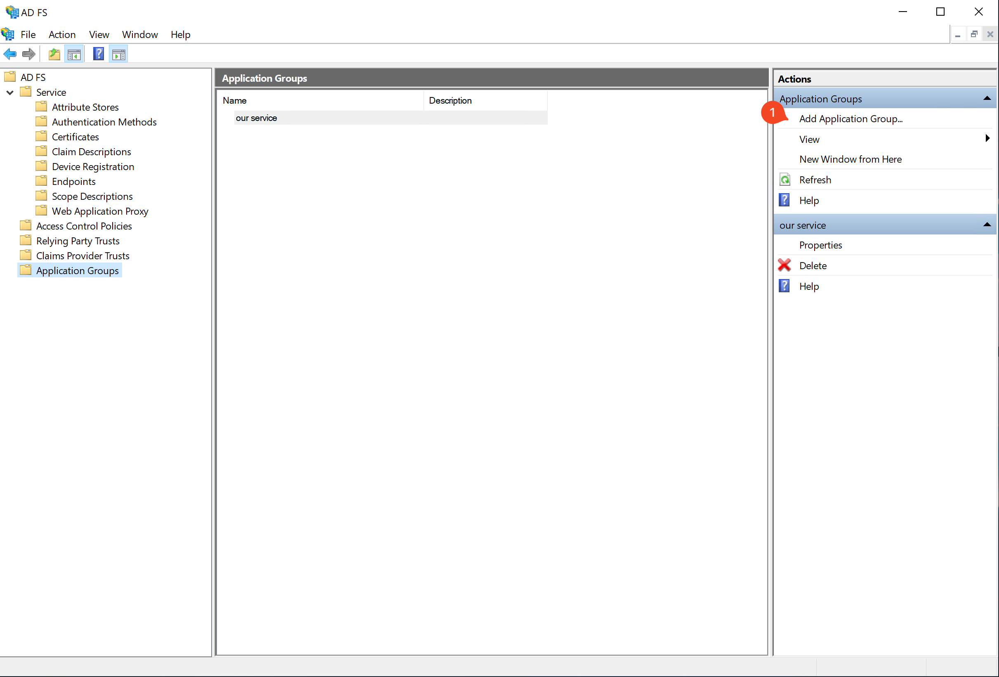

### Step 2: Set Up Server Application

1. Choose "Server application accessing a web API".
2. Assign a name to the server group.
3. Proceed to the next step.

   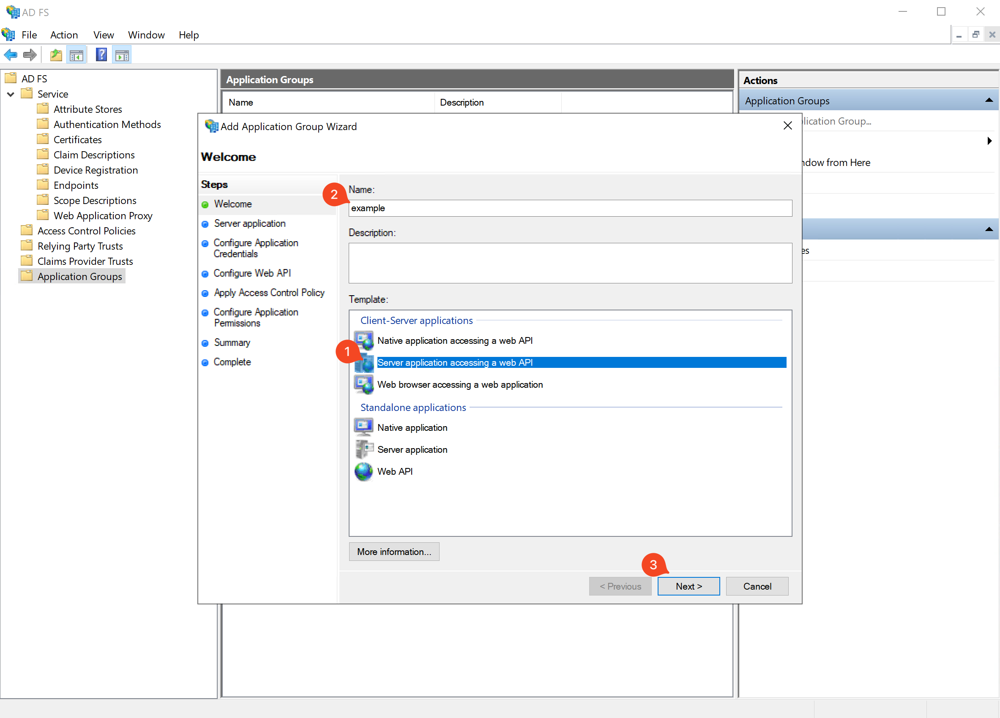

### Step 3: Configure Client Settings

1. Note the client identifier (you'll need this for `ADFS_CLIENT_ID`).
2. Input the callback URL.
3. Add the URL.
4. Move to the next step.

   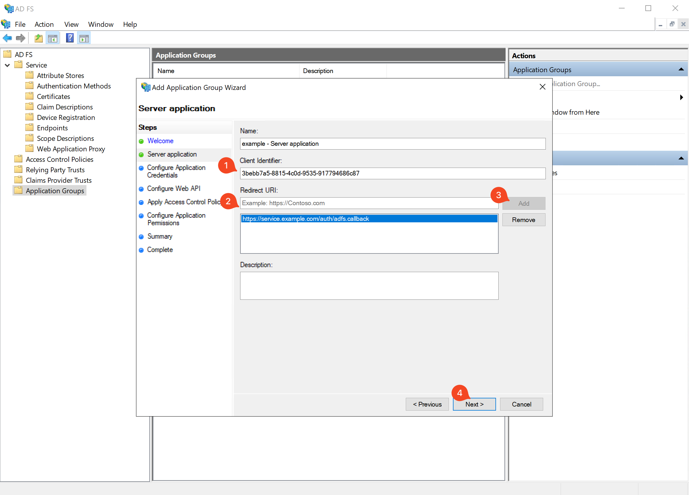

### Step 4: Generate Secret

1. Opt to generate a shared secret.
2. Save this secret (you'll need it for `ADFS_SECRET`).
3. Continue to the next step.

   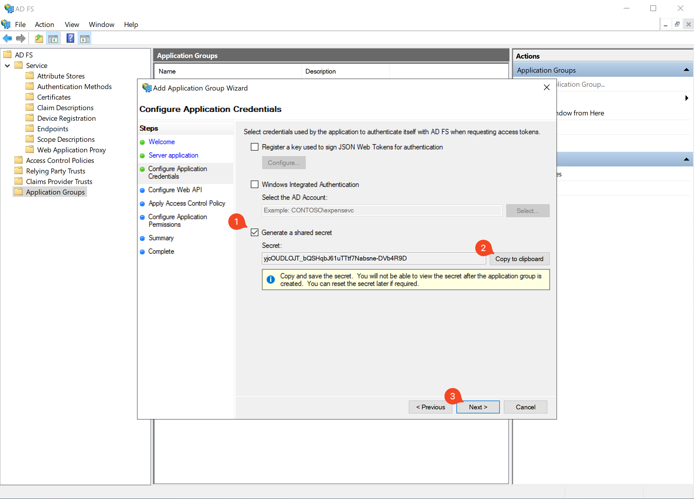

### Step 5: Set Resource Identifier

1. Enter a resource ID (this will appear in the 'aud' claim of the JWT).
2. Save this ID (you'll need it for `ADFS_RESOURCE`).
3. Add the resource.
4. Proceed to the next step.

   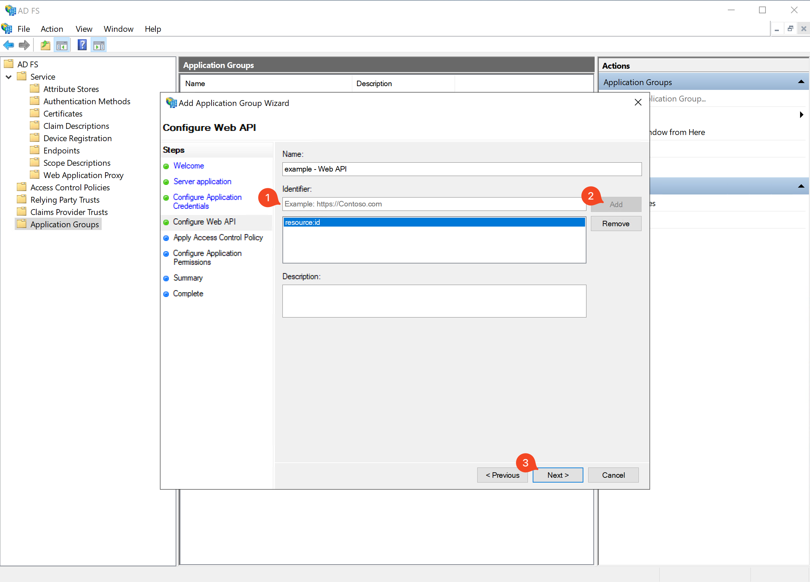

### Step 6: Configure Permissions

1. Set permissions to "Permit everyone".
2. Move to the next step.

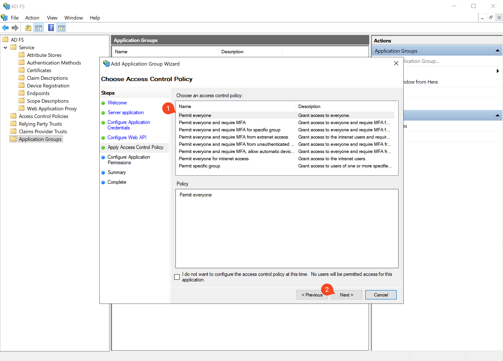

### Step 7: Configure Permission

1. Leave default.

   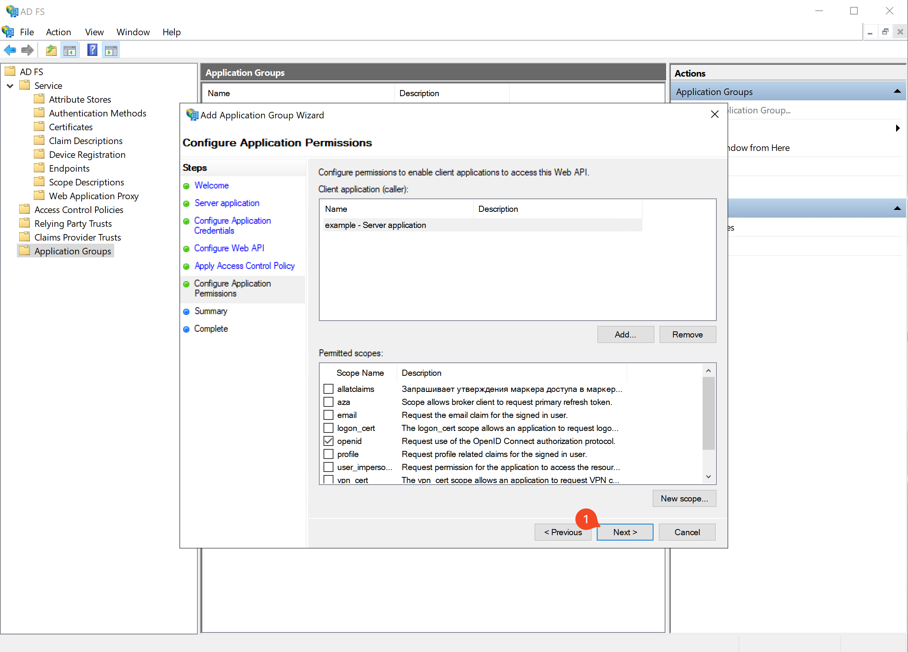

### Step 8: Review Configuration

1. Proceed to finalize the configuration.

   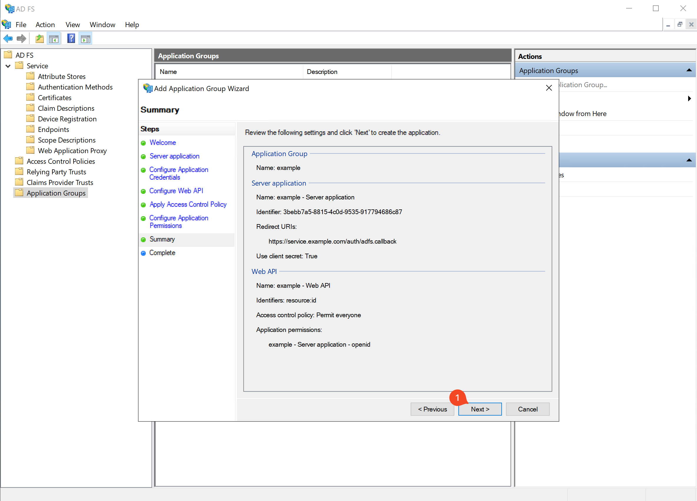

## Configuring Claims

### Step 9: Access Application Group

1. Locate and double-click the newly created application group.

   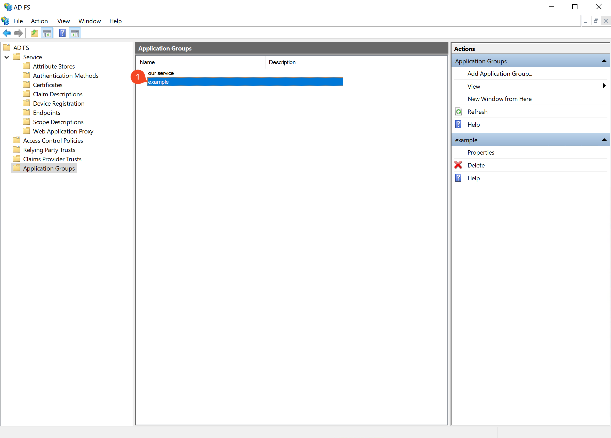

### Step 10: Edit Web API Settings

1. Select the Web API option.
2. Click "Edit".

   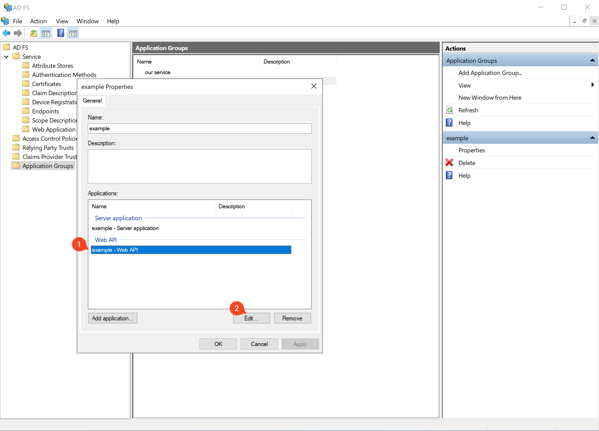

### Step 11: Access Issuance Rules

1. Go to "Issuance and Transform Rules".
2. Select "Add Rule".

   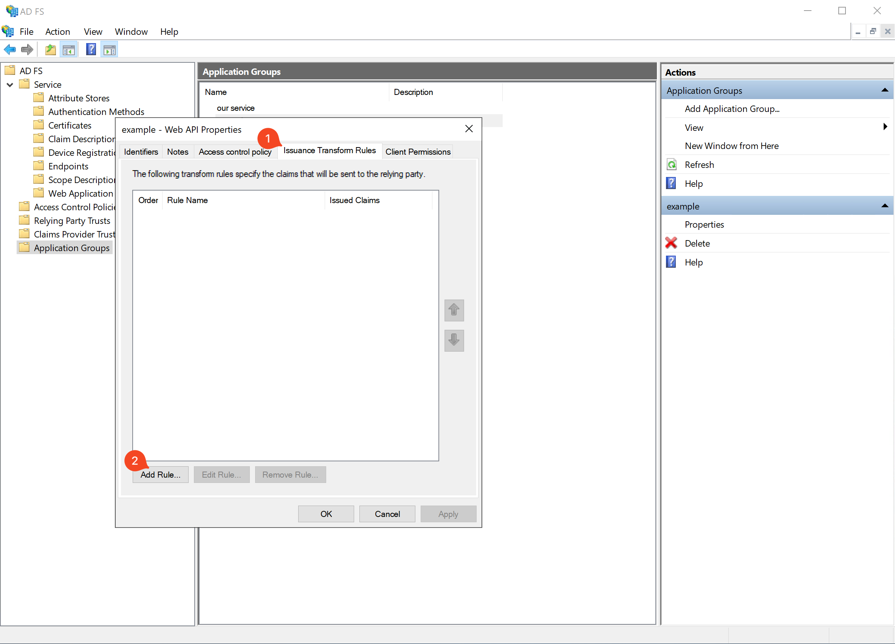

### Step 12: Choose Rule Type

1. Pick "Send LDAP Attributes as Claims".
2. Continue to the next step.

   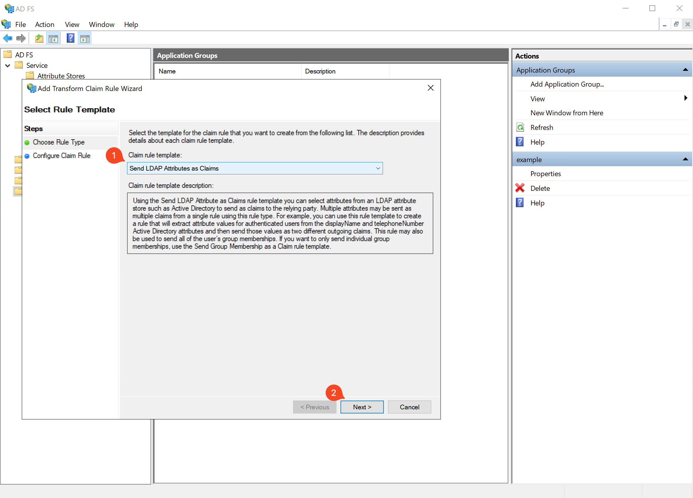

### Step 13: Set Up LDAP Attributes and Claims

1. Name the rule.
2. Choose "Active Directory" as the attribute store.
3. Map the following LDAP attributes to claims:
   - E-mail address → email
   - UPN → sub
   - Display name → commonname
4. Finalize the rule setup.

Note: ADFS doesn't provide additional claims by default. The 'sub' claim is crucial for most systems. Email and name claims are also beneficial. Add any desired profile information as claims here.

    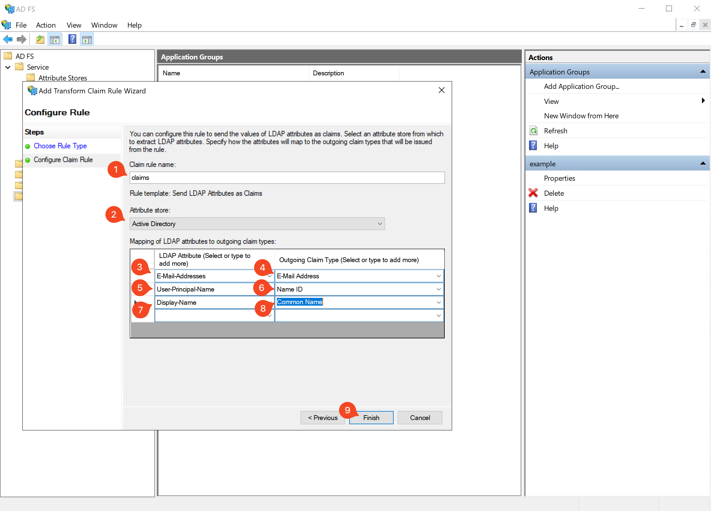

### Step 14: Apply Changes

1. Save and apply the configuration.

   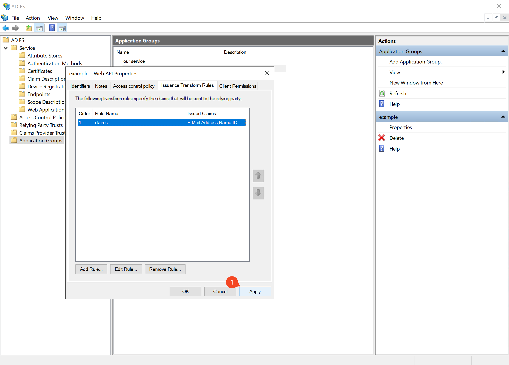

This completes the ADFS setup for `passport-adfs` with custom claims.
